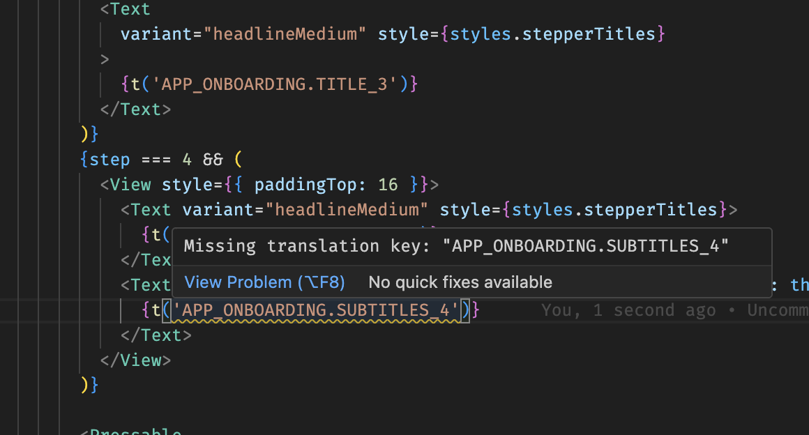

# loco-i18n

`loco-i18n` is a Visual Studio Code extension that helps you manage internationalization (i18n) keys in your JavaScript, TypeScript, React, Svelte, and Vue projects. It automatically scans your code for translation function calls (e.g., `t('key')`), highlights missing keys, and integrates with a Loco translation server to fetch available keys.

## Features

- **Automatic key scanning**: Detects all calls to your translation function (`t('<key>')`) in supported files.  
- **Missing key diagnostics**: Shows warnings for translation keys that are not present in your Loco assets.  
- **Live updates**: Re-scans the file when you save, switch tabs, or refresh keys.  
- **Remote key fetching**: Automatically fetches translation keys from your Loco server.  
- **Customizable settings**: Configure the translation function name, target languages, and Loco API connection.  

<!-- TODO: find a way to host the image -->
  
*Example of missing key diagnostics in the editor.*

---

## Getting Started

1. **Install the extension** from the VS Code marketplace or your VSIX file.  
2. **Configure your settings** in VS Code `settings.json`.  
3. **Open a supported file** (JS, TS, JSX, TSX, Svelte, Vue).  
4. Missing translation keys will be highlighted with a warning in the editor.  
5. Use the **command palette** (`Ctrl+Shift+P` / `Cmd+Shift+P`) and run `Loco-i18n: Refresh Local Keys` to fetch the latest keys from your Loco server and update diagnostics.

---

## Extension Settings

This extension contributes the following settings:

* `locoI18n.tFunctionName` — The name of the translation function to scan for. Default: `"t"`.  
* `locoI18n.targetLanguages` — Languages where the extension should parse translation keys. Default: `["javascript","typescript","javascriptreact","typescriptreact","svelte","vue"]`.  
* `locoI18n.remoteUrl` — The base URL of your Loco API server.  
* `locoI18n.apiKey` — API key for accessing your Loco server.  
* `locoI18n.lang` — The language to fetch from Loco.

---

## Commands

- `Loco-i18n: Refresh Local Keys` — Fetches the latest keys from your Loco server and re-scans the active file.

---

## Known Issues

- Only string literal keys are currently detected (e.g., `t('home.title')`). Dynamic keys (e.g., `t(variable)`) are not analyzed.  
- Large files may trigger a delay in scanning; future versions may add debouncing for performance.  

---

## Upcoming Features

- Add new translations to Loco directly from VS Code through extension commands.  
- Show translation values for existing keys as tooltips when hovering over `t('<key>')`.

---

## Release Notes

### 1.0.0

- Initial release with AST-based key scanning, missing key diagnostics, and Loco integration.

### 1.1.0

## Added

- Quick Fix option on missing keys
- Create key command which creates the untranslated asset in Loco
