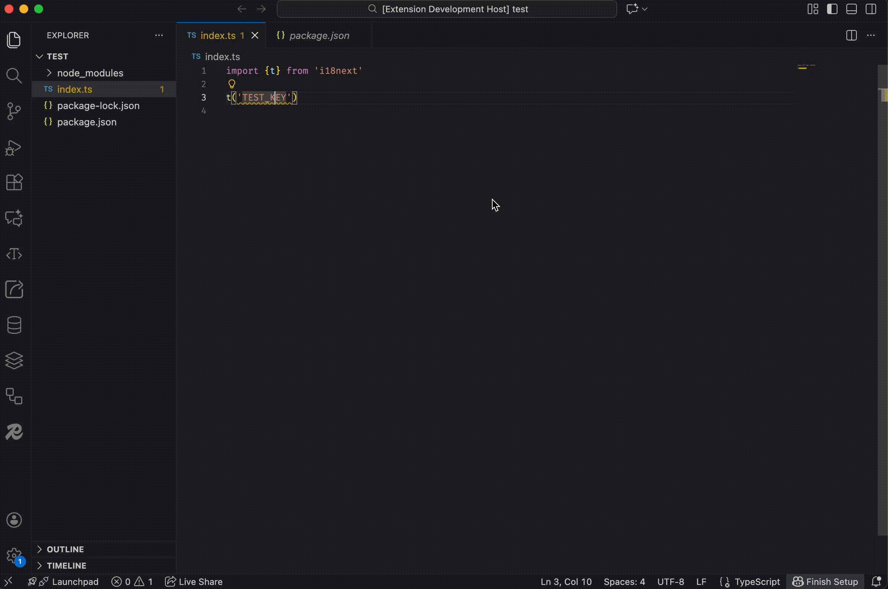

# loco-i18n

`loco-i18n` is a Visual Studio Code extension that helps you manage internationalization (i18n) translations in your JavaScript, TypeScript, React, Svelte, and Vue projects. It automatically scans your code for translation function calls (e.g., `t('key')`), highlights missing translations, and integrates with a Loco translation server to fetch available translations and insert missing ones.

## Features

- **Automatic translation scanning**: Detects all calls to your translation function (`t('<key>')`) in supported files.
- **Missing translation diagnostics**: Shows warnings for translations that are not present in your Loco assets.
- **Quick Fix / Code Action**: Create missing translations directly from the editor.
- **Live updates**: Re-scans the file when you save, switch tabs, or refresh translations.  
- **Inlay hints**: Displays existing translation values inline after the `t('<key>')` calls.  
- **Hover tooltips**: Shows translations when hovering over a key, works even if inlays are disabled.
- **Remote translation fetching**: Automatically fetches translations from your Loco server.
- **Customizable settings**: Configure the translation function name, target languages, and Loco API connection.

---

## Getting Started

1. **Install the extension** from the VS Code marketplace or your VSIX file.  
2. **Configure your settings** in VS Code `settings.json`.  
3. **Open a supported file** (JS, TS, JSX, TSX, Svelte, Vue).  
4. Missing translations will be highlighted with a warning in the editor.  
5. **Quick Fix**: Hover over a missing translation and click the lightbulb to `Create new translation`.  
6. **Command Palette**: Run `Loco-i18n: Create Translation` to create a translation manually.  
7. **Hover or inlay hints**: See existing translations inline or as a tooltip when hovering over keys.  
8. Use `Loco-i18n: Refresh Local Translations` to fetch the latest translations from your Loco server and update diagnostics.

---

## Extension Settings

This extension contributes the following settings:

* `locoI18n.tFunctionName` — The name of the translation function to scan for. Default: `"t"`.  
* `locoI18n.targetLanguages` — Languages where the extension should parse translation keys. Default: `["javascript","typescript","javascriptreact","typescriptreact","svelte","vue"]`.  
* `locoI18n.remoteUrl` — The base URL of your Loco API server.  
* `locoI18n.apiKey` — API key for accessing your Loco server.  
* `locoI18n.lang` — The language to fetch from Loco.

---

## Commands

- `Loco-i18n: Refresh Local Translations` — Fetches the latest translations from your Loco server and re-scans the active file.  
- `Loco-i18n: Create Translation` — Prompts for a key (pre-filled if triggered from Quick Fix) and its translation, then creates the asset and translation in Loco.

---

## Known Issues

- Only string literal keys are currently detected (e.g., `t('home.title')`). Dynamic keys (e.g., `t(variable)`) are not analyzed. 

---

## Release Notes

### 1.0.0

- Initial release with AST-based key scanning, missing key diagnostics, and Loco integration.

### 1.1.0

- Added Quick Fix option on missing keys  
- Added Create Key command which creates the untranslated asset in Loco

### 1.2.0

- Changed approach from key-based to translation-based scanning  
- Added inlay hints and hover tooltips for existing translations
